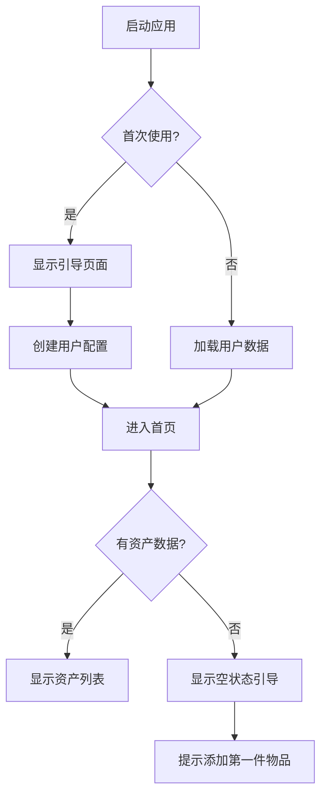
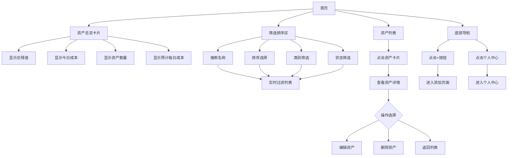
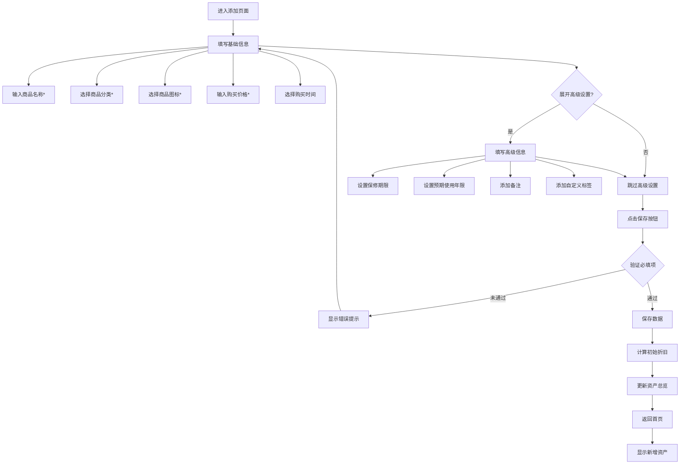
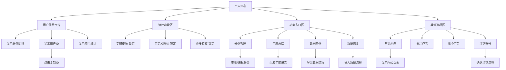
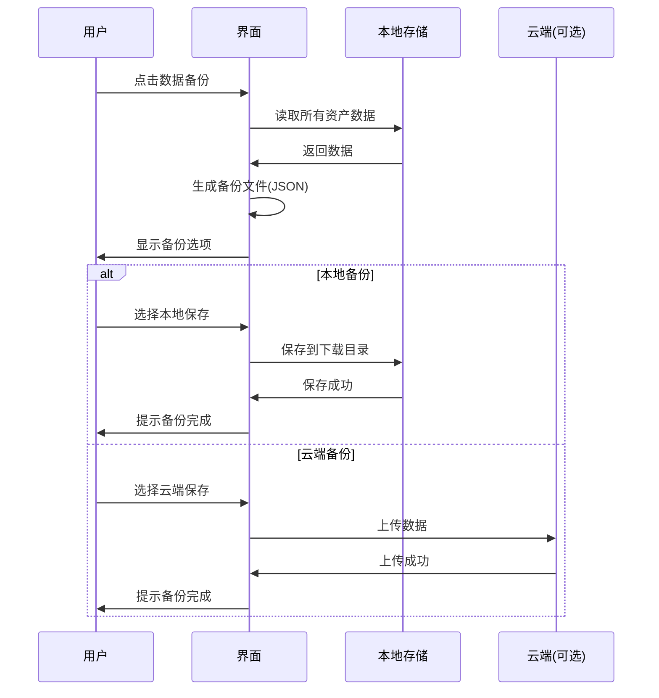
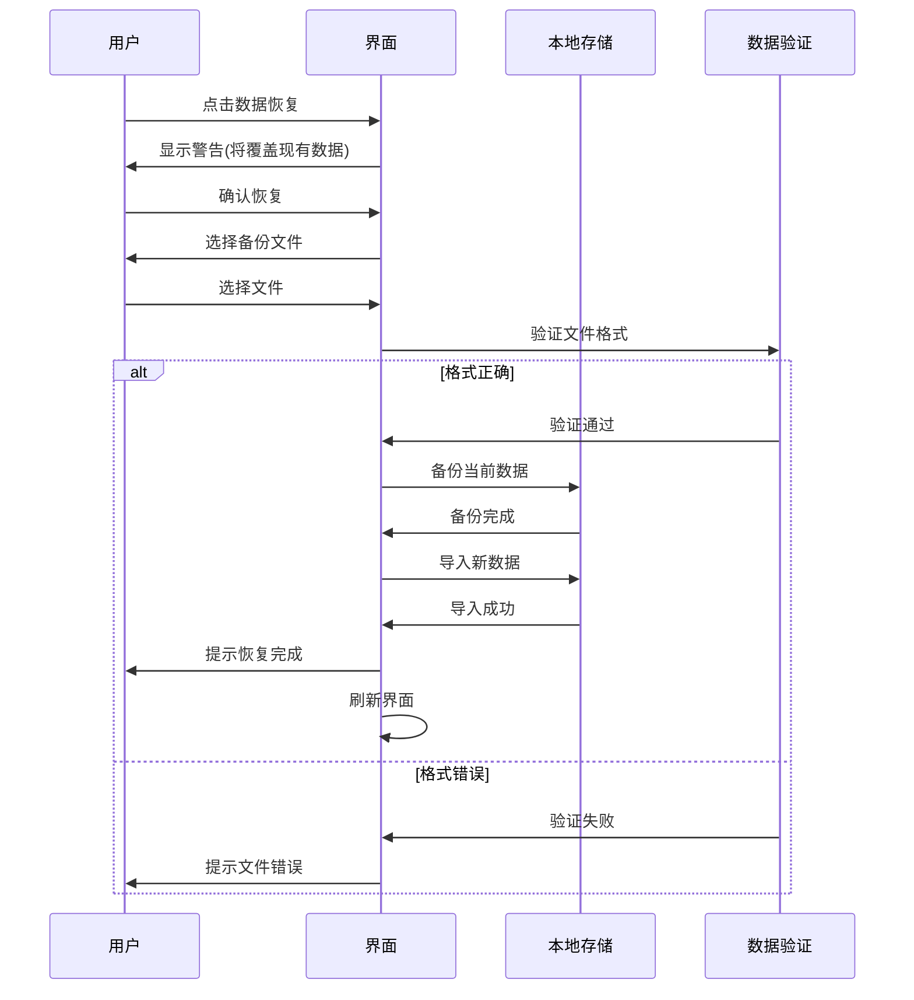
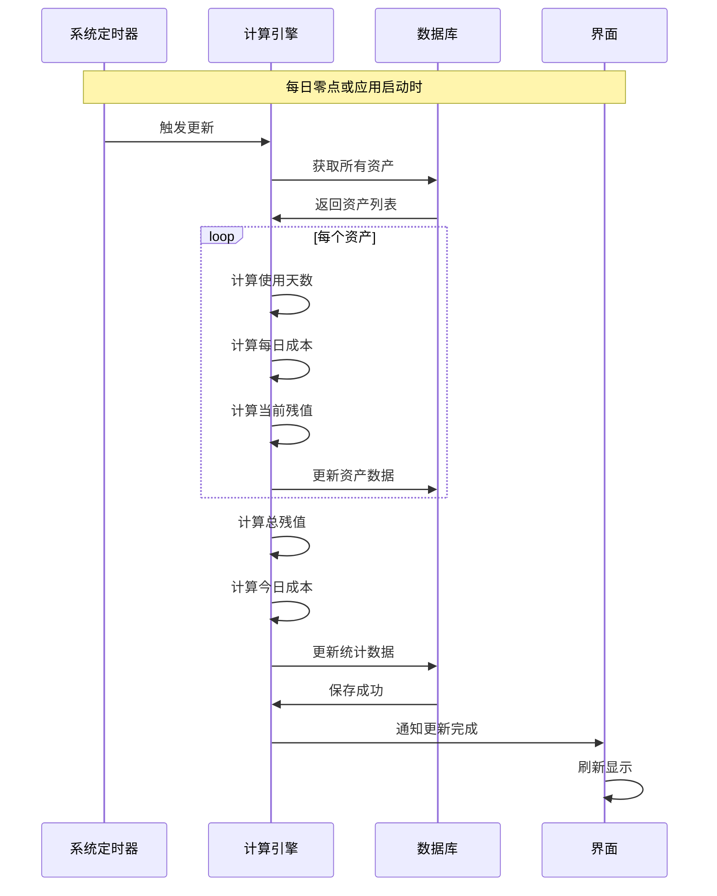
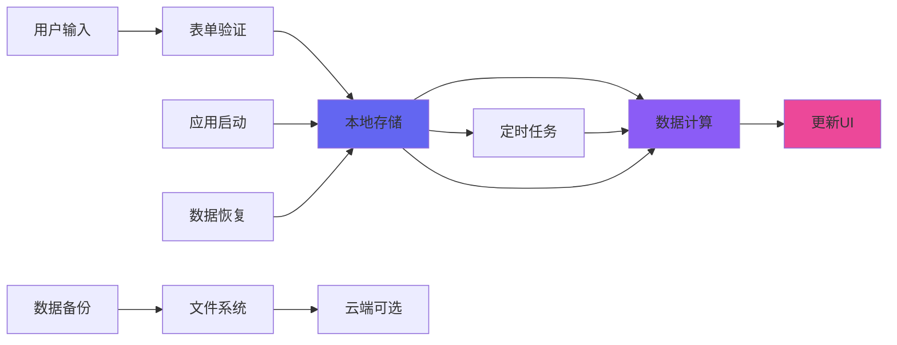
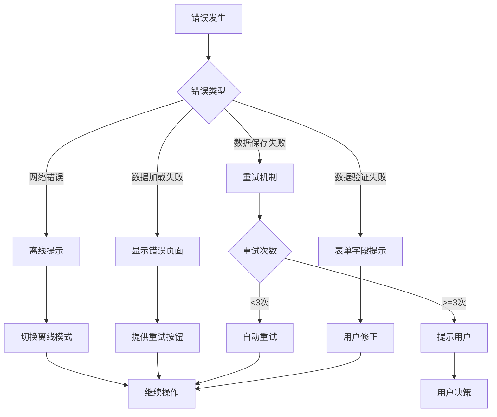

# 应用流程文档 (APP_FLOW.md)
## 亏否 - 资产管理应用流程图

---

## 1. 应用整体架构

```
亏否应用
├── 首页（资产列表）
├── 添加页面
└── 个人中心
```

---

## 2. 页面流程图

### 2.1 应用启动流程



### 2.2 首页交互流程



### 2.3 添加/编辑物品流程



### 2.4 个人中心流程



---

## 3. 详细功能流程

### 3.1 数据备份流程



### 3.2 数据恢复流程



### 3.3 资产数据更新流程



---

## 4. 用户操作路径

### 4.1 快速添加物品（最短路径）

```
首页 → 点击+ → 输入名称 → 选择分类 → 选择图标 → 输入价格 → 保存
```
**预计时间：** 30-60秒

### 4.2 查看资产成本

```
首页 → 查看资产列表 → 查看每日成本
```
**预计时间：** 5秒

### 4.3 筛选特定类别资产

```
首页 → 点击"全部类别" → 选择类别 → 查看筛选结果
```
**预计时间：** 10秒

### 4.4 数据备份完整流程

```
首页 → 个人中心 → 数据备份 → 选择备份方式 → 确认 → 完成
```
**预计时间：** 20-30秒

---

## 5. 页面状态管理

### 5.1 首页状态

| 状态 | 触发条件 | 显示内容 |
|------|---------|---------|
| 空状态 | 无任何资产 | 引导添加第一件物品 |
| 加载中 | 启动应用时 | 加载动画 |
| 正常状态 | 有资产数据 | 完整资产列表 |
| 筛选无结果 | 筛选条件无匹配 | "暂无匹配资产" |
| 错误状态 | 数据加载失败 | 错误提示+重试按钮 |

### 5.2 添加页面状态

| 状态 | 触发条件 | 显示内容 |
|------|---------|---------|
| 初始状态 | 进入页面 | 空表单 |
| 填写中 | 用户输入 | 实时验证 |
| 验证错误 | 必填项缺失 | 红色提示文字 |
| 保存中 | 点击保存 | 按钮loading |
| 保存成功 | 保存完成 | 返回首页 |

### 5.3 个人中心状态

| 状态 | 触发条件 | 显示内容 |
|------|---------|---------|
| 正常显示 | 进入页面 | 完整信息 |
| 处理中 | 执行操作 | loading状态 |
| 功能锁定 | 未解锁功能 | 锁定图标+提示 |

---

## 6. 数据流向图



---

## 7. 错误处理流程

### 7.1 常见错误场景



---

## 8. 性能优化考虑

### 8.1 列表加载优化

- **虚拟滚动：** 资产超过50个启用虚拟列表
- **分页加载：** 每页20条数据
- **图片懒加载：** 滚动到可视区域才加载图标

### 8.2 计算优化

- **缓存机制：** 缓存计算结果，避免重复计算
- **异步计算：** 大量数据时使用Web Worker
- **增量更新：** 只更新变化的数据

### 8.3 存储优化

- **数据压缩：** 备份文件使用压缩
- **定期清理：** 清理过期缓存
- **索引优化：** 为常用查询字段建立索引

---

## 9. 页面跳转映射表

| 起始页面 | 操作 | 目标页面 | 返回路径 |
|---------|------|---------|---------|
| 首页 | 点击+ | 添加页面 | 返回按钮/保存后 |
| 首页 | 点击个人中心 | 个人中心 | 返回按钮 |
| 首页 | 点击资产卡片 | 资产详情 | 返回按钮 |
| 添加页面 | 点击保存 | 首页 | 自动返回 |
| 个人中心 | 分类管理 | 分类管理页 | 返回按钮 |
| 个人中心 | 年度总结 | 年度报告页 | 返回按钮 |
| 个人中心 | 数据备份 | 备份确认弹窗 | 取消/完成 |
| 个人中心 | 常见问题 | FAQ页面 | 返回按钮 |

---

**文档版本：** v1.0  
**最后更新：** 2026-03-06  
**文档所有者：** S.S.
